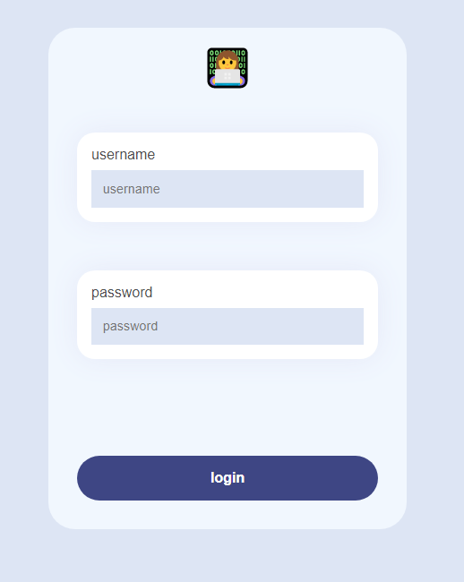

# login-vue-typescript

***
Basic user sign-in project with TypeScript and Vue 3.

 🔑 Use the following credentials to sign in: 

  * username: natalia
  * password: 12345

🔗 To see the project in action, you can try it [here](https://inspiring-bienenstitch-4ac53c.netlify.app/) 
***
### Screenshot



## Project setup
```
npm install
```
if you prefer yarn:
```
yarn install
```

### Compiles and hot-reloads for development
```
npm run serve
```
or 
```
yarn serve
```

### Compiles and minifies for production
```
npm run build
```
or 
```
yarn build
```

### Lints and fixes files
```
npm run lint
```
or
```
yarn lint
```

### Customize configuration
See [Configuration Reference](https://cli.vuejs.org/config/).
